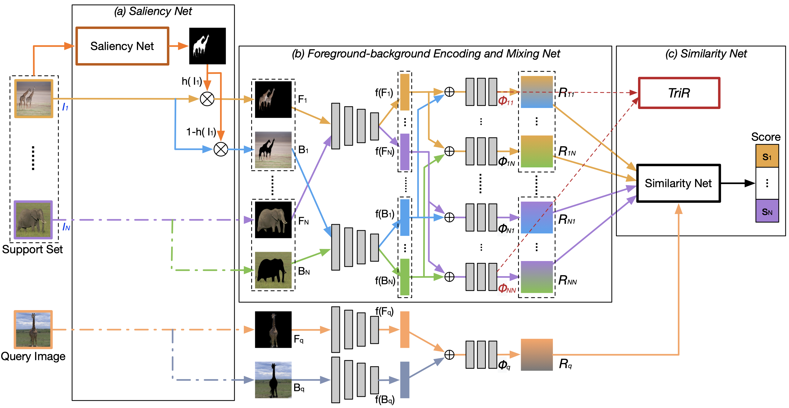

# Few-shot Learning via Saliency-guided Hallucination of Samples
Pytorch Implementation of CVPR19 "[Few-shot Learning via Saliency-guided Hallucination of Samples](http://openaccess.thecvf.com/content_CVPR_2019/papers/Zhang_Few-Shot_Learning_via_Saliency-Guided_Hallucination_of_Samples_CVPR_2019_paper.pdf)"<br/>



This is developed based on the code of [Relation Net](https://github.com/floodsung/LearningToCompare_FSL) and [SoSN](https://github.com/HongguangZhang/SoSN-wacv19-master). <br/>

Download formatted miniImagenet and the saliency maps: <br/>
https://drive.google.com/file/d/1fOWbhpjTaQ9lc7z8Sndi6jWFwtLRsapY/view?usp=sharing <br/>
Decompress it into './datas'<br/>

__Requires.__
```
pytorch-0.4.1
numpy
scipy
```

__For miniImagenet training and testing, run following commands.__

```
cd ./miniimagenet
python miniimagenet_train_few_shot_SalNet_IntraClass.py -w 5 -s 1
python miniimagenet_test_few_shot_SalNet_IntraClass.py -w 5 -s 1
```

## Citation
If you use this code in your research, please cite the following paper.

```
@InProceedings{Zhang_2019_CVPR,
author = {Zhang, Hongguang and Zhang, Jing and Koniusz, Piotr},
title = {Few-Shot Learning via Saliency-Guided Hallucination of Samples},
booktitle = {The IEEE Conference on Computer Vision and Pattern Recognition (CVPR)},
month = {June},
year = {2019}
}
```


